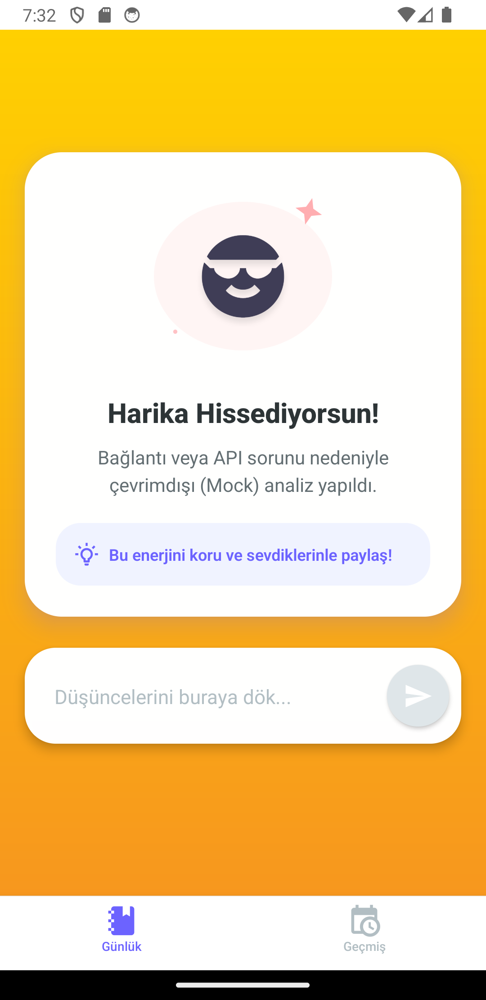
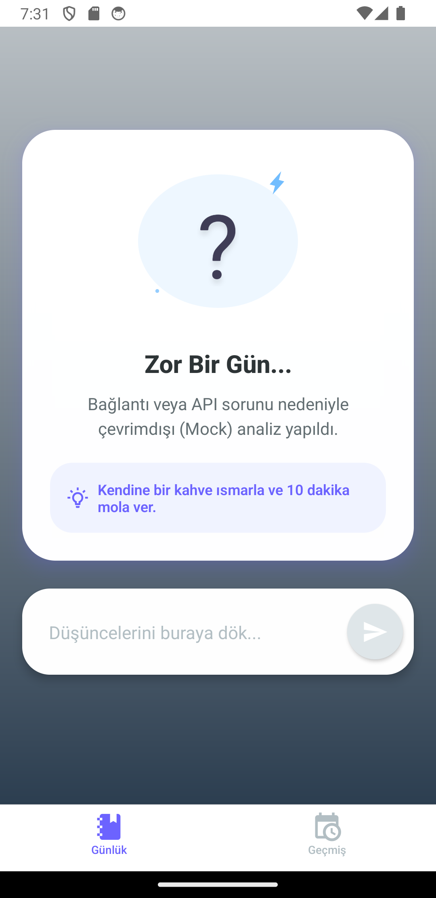
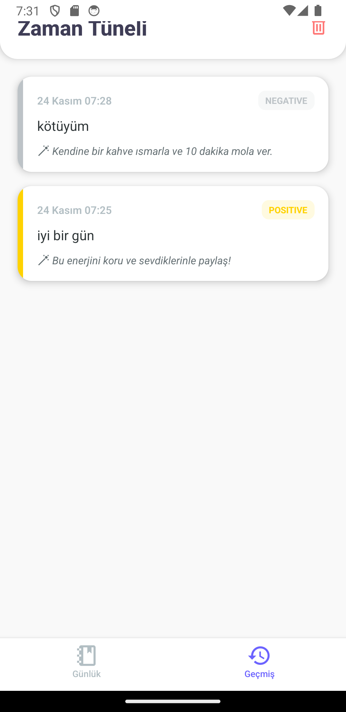

🧠 AI Günlük Asistanım (AI Daily Journal Assistant)

"Bugün nasıl hissediyorsun?"

Kullanıcıların günlük duygu durumlarını analiz eden, ruh haline göre renk değiştiren ve internet olmasa bile çalışan yapay zeka destekli akıllı asistan.

📱 Uygulama Önizlemesi (App Preview)

Uygulama, duygu durumuna göre dinamik olarak renk, tema ve vektörel illüstrasyonları değiştirir.

🌞 Pozitif Mod (Sarı Tema)

🌧️ Negatif / Nötr Mod

📜 Geçmiş & İstatistikler

🌟 Özellikler (MVP & Bonus)

🧠 Gerçek Zamanlı AI Analizi: Hugging Face Inference API (twitter-xlm-roberta-base-sentiment) kullanılarak yazılan metnin duygu analizi (Pozitif/Negatif/Nötr) yapılır.

🎨 Duygusal UI (Adaptive Design): Kullanıcının ruh haline göre uygulama rengi ve illüstrasyonlar anlık olarak değişir (Sarı=Mutlu, Gri=Üzgün, Mor=Nötr).

📡 Offline-First Mimarisi: İnternet bağlantısı kopsa bile uygulama çökmez, yerel "Mock AI" servisi devreye girer.

💾 Kalıcı Veri: Tüm günlükler AsyncStorage ile cihazda güvenli bir şekilde saklanır.

🛡️ Güvenli İstekler: Ağ katmanında Idempotency (Tekrarlanamazlık) anahtarı yönetimi.

🛠️ Teknik Yığın (Tech Stack)

Bu proje, modern React Native CLI ve Senior Yazılım Mimarisi prensipleri (Modüler Yapı, Separation of Concerns) kullanılarak geliştirilmiştir.

Core: React Native CLI (JavaScript)

State Management: Context API (JournalContext, AuthContext)

Navigation: React Navigation (Bottom Tabs)

AI Provider: Hugging Face (Multilingual Sentiment Model)

UI Library: Linear Gradient, Vector Icons, Custom Illustrations

Architecture: Modular Pattern (API, Config, Context, Screens ayrımı)

📂 Proje Mimarisi

Spagetti koddan kaçınmak için ölçeklenebilir ve sürdürülebilir bir klasör yapısı tercih edilmiştir:

src/
├── api/          # API servisleri ve Mock yapısı (aiService.js)
├── components/   # Tekrar kullanılabilir UI parçaları (SmartIllustration.js)
├── config/       # Sabitler, Temalar ve API Anahtarları (theme.js, constants.js)
├── context/      # Global State Yönetimi (JournalContext.js)
├── screens/      # Kullanıcı arayüzü sayfaları (HomeScreen, HistoryScreen)
└── utils/        # Yardımcı fonksiyonlar (helpers.js)

🚀 Kurulum ve Çalıştırma

Bu projeyi kendi bilgisayarınızda çalıştırmak için aşağıdaki adımları izleyin:

1. Ön Gereksinimler

Node.js (>= 18)

Java 17 (JDK 17) - Proje Java 17 ile uyumludur.

Android Studio & SDK (API 34)

2. Repoyu Klonlayın

git clone [https://github.com/NevzatNas/GunlukAsistaniApp.git](https://github.com/NevzatNas/GunlukAsistaniApp.git)
cd GunlukAsistaniApp

3. Bağımlılıkları Yükleyin

npm install

4. Uygulamayı Başlatın

npx react-native run-android

🤖 AI Araç Kullanım Beyanı

Bu projenin geliştirme sürecinde, kod kalitesini artırmak ve mimari kararları optimize etmek için AI Asistanlarından (LLM) faydalanılmıştır.

Mimari: Projenin klasör yapısı ve "Separation of Concerns" prensibi AI rehberliğinde tasarlanmıştır.

Hata Ayıklama: Gradle sürüm uyumsuzlukları, NDK hataları ve Java ortam değişkeni sorunları, AI ile pair-programming yapılarak çözülmüştür.

Kod Üretimi: SmartIllustration bileşeni ve LinearGradient renk geçişleri için temel kod blokları AI desteğiyle oluşturulmuştur.

🔑 API Konfigürasyonu

Uygulama varsayılan olarak çalışır durumdadır. Kendi API anahtarınızı kullanmak isterseniz:

src/config/constants.js dosyasını açın.

HF_API_KEY alanına Hugging Face anahtarınızı yapıştırın.

USE_MOCK: false olduğundan emin olun.

